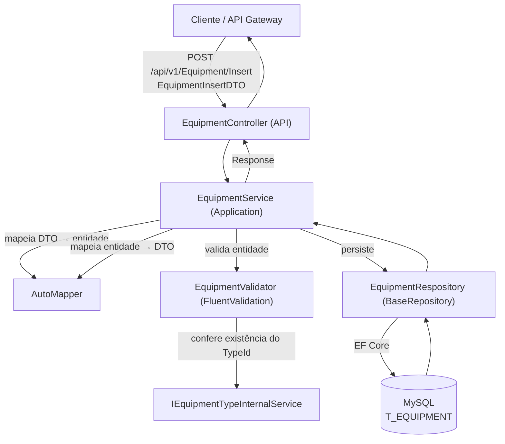
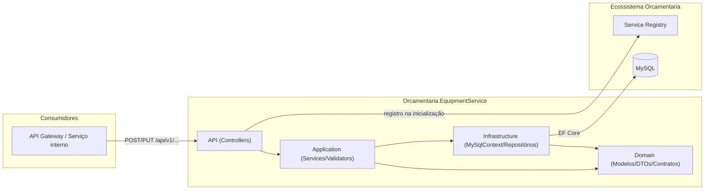
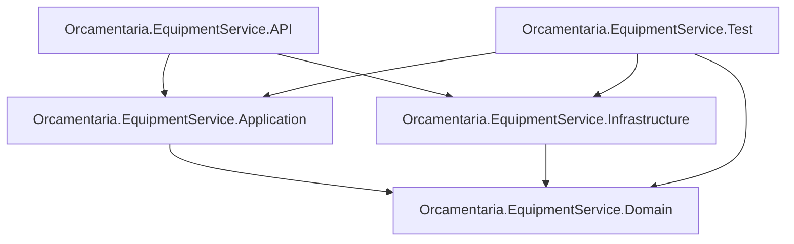

# 🛠️ Orcamentaria.EquipmentService

Microsserviço do ecossistema **Orcamentaria** responsável pelo domínio de **equipamentos**: cadastro de equipamentos, seus tipos e o registro de manutenções realizadas, com suporte multiempresa (multi-tenant).

---

## 🎯 Objetivo

O `Orcamentaria.EquipmentService` centraliza o controle de equipamentos de uma empresa dentro do ecossistema Orcamentaria:

1. Manter o cadastro de **tipos de equipamento** (`EquipmentType`);
2. Manter o cadastro de **equipamentos** (`Equipment`), vinculados a um tipo e com uma periodicidade de manutenção definida;
3. Registrar o **histórico de manutenções** (`EquipmentMaintenance`) realizadas em cada equipamento.

Todas as entidades são isoladas por empresa (`CompanyId`), e as regras de negócio validam a consistência entre elas — por exemplo, um equipamento só pode ser cadastrado com um tipo (`TypeId`) que exista de fato.

---

## 🧰 Tecnologias

| Tecnologia | Versão | Finalidade |
|---|---|---|
| C# / .NET | 9 (`net9.0`) | Linguagem e runtime da aplicação |
| ASP.NET Core Web API | `Microsoft.NET.Sdk.Web` | Hospedagem HTTP |
| Entity Framework Core | 9.0.11 | ORM de acesso a dados |
| `MySql.EntityFrameworkCore` | 9.0.9 | Provider EF Core para MySQL |
| `Orcamentaria.Lib.Domain` | 10.1.1 | Modelos, enums, exceptions e contratos compartilhados do ecossistema |
| `Orcamentaria.Lib.Application` | 2.1.4 | Implementações compartilhadas de HTTP client, Service Registry e cache |
| `Orcamentaria.Lib.Infrastructure` | 5.4.0 | Composição de serviços e middlewares comuns a todos os serviços do ecossistema |
| `Orcamentaria.Lib.Test` | 1.1.2 | Fixtures e classes base de teste compartilhadas (`BaseFixture`, `ReadWithCompanyRepositoryTests`, `WriteWithCompanyRepositoryTests`) |
| AutoMapper | 16.0.0 | Mapeamento entre entidades de domínio e DTOs |
| FluentValidation | 12.1.1 | Validação das entidades antes de inserir/atualizar |
| xUnit / Moq / Moq.AutoMock / FluentAssertions / Bogus | — | Stack de testes unitários (`Orcamentaria.EquipmentService.Test`) |

As dependências são gerenciadas via `PackageReference` nos arquivos `.csproj` de cada projeto (não há uso de `packages.config`).

---

## 🏗️ Arquitetura

O projeto segue uma **arquitetura em camadas**, apoiada na biblioteca interna compartilhada `Orcamentaria.Lib`:

- **Domain**: modelos (`Equipment`, `EquipmentType`, `EquipmentMaintenance`), DTOs, enums, mappers do AutoMapper e contratos (`IEquipmentService`, `IEquipmentRepository<T>`, etc.), sem dependência de frameworks web ou de acesso a dados.
- **Application**: implementação dos serviços de negócio (`EquipmentService`, `EquipmentTypeService`, `EquipmentMaintenanceService`) e dos validadores FluentValidation.
- **Infrastructure**: `MySqlContext` (EF Core), `IEntityTypeConfiguration<T>` de cada entidade e os repositórios concretos, que herdam de `BaseRepository<T>` (fornecido por `Orcamentaria.Lib.Infrastructure`).
- **API**: Controllers, composição de injeção de dependência (`Startup.cs`), chaves públicas para validação de token.

Fluxo de dependência entre camadas: `API → Infrastructure/Application → Domain`, sempre apontando para dentro.

---

## 📁 Estrutura do Projeto

```text
Orcamentaria.EquipmentService/
├── Orcamentaria.EquipmentService.API/              # Apresentação HTTP (composition root)
│   ├── Controllers/v1/EquipmentController.cs       #   Get/Insert/Update de Equipment
│   ├── Controllers/v1/EquipmentTypeController.cs   #   Get/Insert/Update de EquipmentType
│   ├── Controllers/v1/EquipmentMaintenanceController.cs # Get/Insert de EquipmentMaintenance
│   ├── Keys/                                       #   Chaves públicas para validação de token
│   ├── Program.cs / Startup.cs                     #   Bootstrap e injeção de dependências
│   └── appsettings*.json                           #   Configuração da aplicação
├── Orcamentaria.EquipmentService.Application/      # Regras de negócio
│   ├── Services/EquipmentService.cs
│   ├── Services/EquipmentTypeService.cs
│   ├── Services/EquipmentMaintenanceService.cs
│   └── Validators/*.cs                             #   Validadores FluentValidation
├── Orcamentaria.EquipmentService.Domain/           # Contratos, modelos e DTOs
│   ├── Models/Equipment.cs, EquipmentType.cs, EquipmentMaintenance.cs
│   ├── Enums/MaintenancePeriodEnum.cs
│   ├── DTOs/Equipment, EquipmentType, EquipmentMaintenance
│   ├── Mappers/*.cs                                #   Profiles do AutoMapper
│   ├── Repositories/*.cs                           #   Contratos de repositório
│   └── Services/*.cs, Services/Internal/*.cs       #   Contratos de serviço (públicos e internos)
├── Orcamentaria.EquipmentService.Infrastructure/   # Acesso a dados
│   ├── Contexts/MySqlContext.cs
│   ├── Configurations/*.cs                         #   Mapeamento EF Core (Fluent API)
│   └── Repositories/*.cs                           #   Implementações via BaseRepository<T>
├── Orcamentaria.EquipmentService.Test/             # Testes unitários (xUnit + Moq.AutoMock)
│   ├── Fixtures/*.cs
│   ├── Contexts/MySqlContextTest.cs
│   ├── Services/*.cs
│   ├── Repositories/*.cs
│   └── Validators/*.cs
└── Orcamentaria.EquipmentService.sln
```

---

## 🔄 Fluxo da Aplicação



**Passo a passo (exemplo de inserção de um Equipment):**
1. O cliente (tipicamente o `Orcamentaria.APIGetaway`, roteando em nome de um consumidor autenticado) envia `EquipmentInsertDTO` para `POST /api/v1/Equipment/Insert`.
2. `EquipmentController` delega para `EquipmentService.InsertAsync`.
3. O DTO é convertido em entidade `Equipment` via AutoMapper.
4. `EquipmentValidator` valida os campos obrigatórios e tamanhos máximos, e confirma que o `TypeId` informado existe (consultando `IEquipmentTypeInternalService`).
5. Se a validação falhar, é lançada uma `ValidationException`; se passar, o repositório persiste a entidade via `MySqlContext` (EF Core).
6. A entidade persistida é convertida de volta para `EquipmentResponseDTO` e devolvida encapsulada em `Response<EquipmentResponseDTO>`.

---

## 📦 Dependências principais

| Biblioteca | Uso no projeto |
|---|---|
| `Orcamentaria.Lib.Domain` | Modelos base (`TenantEntity`), `GridParams`, `Response<T>`/`ResponsePagination`, exceptions de domínio (`DefaultException`, `InfoException`, `UnexpectedException`, `ValidationException`), `IValidatorEntity<T>`, `ErrorCodeEnum`. |
| `Orcamentaria.Lib.Application` | Serviços compartilhados de infraestrutura de aplicação usados via `Orcamentaria.Lib.Infrastructure`. |
| `Orcamentaria.Lib.Infrastructure` | `ResolveConfigs`, `AddServiceRegistryHosted`, `ResolveCommonServicesWithMySql<TContext>` e `ConfigureCommon`, usados em `Startup.cs` para registrar a aplicação no Service Registry e configurar autenticação, Swagger, CORS, mensageria e o `DbContext` MySQL. Também fornece `BaseRepository<T>`, herdado pelos repositórios concretos. |
| `Orcamentaria.Lib.Test` | `BaseFixture<T>`, `ReadWithCompanyRepositoryTests<TEntity, TContext>` e `WriteWithCompanyRepositoryTests<TEntity, TContext>`, usados como base dos testes de repositório. |
| AutoMapper | Profiles `EquipmentMapper`, `EquipmentTypeMapper`, `EquipmentMaintenanceMapper` convertendo entidades ↔ DTOs. |
| FluentValidation | `EquipmentValidator`, `EquipmentTypeValidator`, `EquipmentMaintenanceValidator`, implementando `IValidatorEntity<T>`. |
| Entity Framework Core + `MySql.EntityFrameworkCore` | Acesso a dados via `MySqlContext`, com mapeamento explícito das tabelas em `Orcamentaria.EquipmentService.Infrastructure/Configurations`. |

---

## ⚙️ Configuração

A aplicação usa o modelo padrão de configuração do ASP.NET Core (`appsettings.json` + `appsettings.{Environment}.json` + variáveis de ambiente).

**`Orcamentaria.EquipmentService.API/appsettings.json`:**
```json
{
  "Logging": {
    "LogLevel": {
      "Default": "Information",
      "Microsoft.AspNetCore": "Warning"
    }
  },
  "ApiGetawayConfiguration": {
    "BaseUrl": "https://localhost:44385"
  }
}
```

O arquivo também define um segredo de bootstrap consumido internamente por `Orcamentaria.Lib.Infrastructure` (`ResolveConfigs`) para autenticar o serviço e buscar, no `Orcamentaria.ConfigBagService`, o restante das suas configurações (connection string do MySQL, `ServiceRegistryConfiguration`, `MessageBrokerConfiguration`, `ServiceConfiguration`) — seu valor não é reproduzido aqui. `ApiGetawayConfiguration.BaseUrl` e o segredo de bootstrap são as únicas exceções que ficam no `appsettings.json` local, por serem necessários para localizar o Gateway e se autenticar antes dessa busca.

**`Orcamentaria.EquipmentService.API/appsettings.Development.json`:** contém overrides de `Logging` para o ambiente de desenvolvimento.

- **`ApiGetawayConfiguration.BaseUrl`**: endereço do API Gateway do ecossistema.
- **`Startup.ConfigureServices`** chama `services.ResolveConfigs(...)` e `services.AddServiceRegistryHosted(...)`, integrando o serviço ao Service Registry, e `services.ResolveCommonServicesWithMySql<MySqlContext>(...)`, que configura a infraestrutura comum (autenticação, Swagger, CORS, mensageria) e o `DbContext` MySQL a partir da configuração resolvida.

---

## 🔑 Variáveis de Ambiente

| Variável | Descrição |
|---|---|
| `ASPNETCORE_ENVIRONMENT` | Define o ambiente ASP.NET Core (default `Development` via `launchSettings.json`). |
| `ApiGetawayConfiguration__BaseUrl` | URL do API Gateway (default `https://localhost:44385`). |

Demais parâmetros de conexão (banco de dados, mensageria) são resolvidos em tempo de execução pela infraestrutura comum do ecossistema (`Orcamentaria.Lib.Infrastructure`), a partir da configuração central obtida via `ResolveConfigs`.

---

## 🗄️ Banco de Dados

O serviço usa **MySQL**, acessado via **Entity Framework Core** (`MySql.EntityFrameworkCore`) através de `MySqlContext`.

**Tabelas mapeadas (Fluent API, em `Orcamentaria.EquipmentService.Infrastructure/Configurations`):**

| Entidade | Tabela | Observações |
|---|---|---|
| `Equipment` | `T_EQUIPMENT` | Colunas: `ID`, `NAME`, `DESCRIPTION`, `MANUFACTURER`, `EQUIPMENT_TYPE_ID`, `MAINTENANCE_PERIOD`, `ACTIVE`, `COMPANY_ID`, `CREATED_AT`, `CREATED_BY`, `UPDATED_AT`, `UPDATED_BY`. Possui FK (`fk_T_EQUIPMENT_T_EQUIPMENT_TYPE`) para `EquipmentType`. |
| `EquipmentType` | (mapeada em `EquipmentTypeConfiguration`) | Entidade `TenantEntity`, com `Name` e `Active`. |
| `EquipmentMaintenance` | (mapeada em `EquipmentMaintenanceConfiguration`) | Relaciona-se a `Equipment` via `EquipmentId`, com `CompanyId`, `CreatedAt` e `CreatedBy`. |

`Equipment` e `EquipmentType` herdam de `TenantEntity` (`Orcamentaria.Lib.Domain.Entities`), que adiciona os campos multiempresa/auditoria (`CompanyId`, `CreatedAt`, `CreatedBy`, `UpdatedAt`, `UpdatedBy`) usados pelo `BaseRepository<T>` para isolar dados por empresa automaticamente.

---

## ▶️ Como Executar

### Pré-requisitos
- [.NET SDK 9.0](https://dotnet.microsoft.com/download)
- Instância MySQL acessível
- Service Registry em execução (o serviço se registra nele na inicialização)
- API Gateway acessível em `ApiGetawayConfiguration:BaseUrl`, caso as chamadas sejam feitas via Gateway

### Passo a passo

```bash
git clone <url-do-repositorio>
cd Orcamentaria.EquipmentService

dotnet restore
dotnet build

dotnet run --project Orcamentaria.EquipmentService.API
```

A API sobe, por padrão, em `https://localhost:53092` (perfil HTTP: `http://localhost:53093`), abrindo automaticamente o navegador.

---

## 🧪 Como Rodar Testes

O projeto de testes (`Orcamentaria.EquipmentService.Test`) usa **xUnit**, **Moq.AutoMock**, **FluentAssertions** e as classes base de `Orcamentaria.Lib.Test`.

```bash
dotnet test
```

**Cobertura por classe testada:**

| Classe testada | Cenários cobertos |
|---|---|
| `EquipmentService` / `EquipmentTypeService` / `EquipmentMaintenanceService` | Busca por id, listagem paginada (com e sem dados), inserção e atualização (sucesso e falha de validação) |
| `EquipmentValidator` / `EquipmentTypeValidator` / `EquipmentMaintenanceValidator` | Regras de obrigatoriedade, tamanho máximo de campos e existência de referências (`TypeId`, `Id` em update) |
| `EquipmentRespository` / `EquipmentTypeRespository` / `EquipmentMaintenanceRespository` (via `ReadWithCompanyRepositoryTests` / `WriteWithCompanyRepositoryTests`) | Leitura e escrita com isolamento por empresa (`CompanyId`) |

---

## 🧭 APIs

### Endpoints

| Método | Rota | Descrição | Autorização (Roles) |
|---|---|---|---|
| `POST` | `/api/v1/Equipment/Get` | Lista equipamentos de forma paginada (`GridParams`), incluindo o tipo (`Type`) relacionado. | `MASTER`, `EQUIPMENT:READ` |
| `POST` | `/api/v1/Equipment/Insert` | Cadastra um novo equipamento (`EquipmentInsertDTO`). | `MASTER`, `EQUIPMENT:INSERT` |
| `PUT` | `/api/v1/Equipment/Update/{id}` | Atualiza um equipamento existente (`EquipmentUpdateDTO`). | `MASTER`, `EQUIPMENT:UPDATE` |
| `POST` | `/api/v1/EquipmentType/Get` | Lista tipos de equipamento de forma paginada. | `MASTER`, `EQUIPMENT:READ` |
| `POST` | `/api/v1/EquipmentType/Insert` | Cadastra um novo tipo de equipamento (`EquipmentTypeInsertDTO`). | `MASTER`, `EQUIPMENT:INSERT` |
| `PUT` | `/api/v1/EquipmentType/Update/{id}` | Atualiza um tipo de equipamento existente (`EquipmentTypeUpdateDTO`). | `MASTER`, `EQUIPMENT:UPDATE` |
| `POST` | `/api/v1/EquipmentMaintenance/Get` | Lista manutenções de equipamentos de forma paginada, incluindo o equipamento e seu tipo. | `MASTER`, `EQUIPMENT:READ` |
| `POST` | `/api/v1/EquipmentMaintenance/Insert` | Registra uma nova manutenção (`EquipmentMaintenanceInsertDTO`). | `MASTER`, `EQUIPMENT:INSERT` |

Todas as respostas de sucesso são encapsuladas em `Response<T>` (dado + paginação, quando aplicável), padrão compartilhado do ecossistema (`Orcamentaria.Lib.Domain`).

---

## 🔗 Integrações

| Integração | Descrição |
|---|---|
| **Service Registry** | O serviço se registra na inicialização via `AddServiceRegistryHosted`, permitindo que seja descoberto e roteado pelo API Gateway. |
| **API Gateway (`Orcamentaria.APIGetaway`)** | Endereço configurado em `ApiGetawayConfiguration:BaseUrl`; é a via padrão de acesso externo aos endpoints deste serviço e o intermediário para a busca de configuração remota. |
| **ConfigBagService** | Fonte centralizada da configuração do serviço (connection string, Service Registry, mensageria), buscada via API Gateway durante o bootstrap. |
| **MySQL** | Banco de dados relacional do serviço, acessado via EF Core. |

---

## 📈 Logs

Logging via `Microsoft.Extensions.Logging`, configurado em `appsettings.json`:

```json
"Logging": {
  "LogLevel": {
    "Default": "Information",
    "Microsoft.AspNetCore": "Warning"
  }
}
```

---

## 🚨 Tratamento de Erros

Os serviços da camada de Application capturam exceptions de negócio conhecidas (`DefaultException` e suas derivadas — `InfoException`, `ValidationException`) e as relançam sem alteração; exceptions inesperadas são encapsuladas em `UnexpectedException` antes de subir para o middleware central de tratamento de erros da infraestrutura comum (`Orcamentaria.Lib.Infrastructure`), responsável por formatar a resposta de erro.

- `InfoException` (`ErrorCodeEnum.NotFound`) é usada quando uma consulta não retorna dados.
- `ValidationException` é usada quando o `FluentValidation` identifica campos inválidos.

---

## 🔐 Segurança

Os Controllers usam `[Authorize(Roles = "...")]` do ASP.NET Core, com papéis granulares por operação (`EQUIPMENT:READ`, `EQUIPMENT:INSERT`, `EQUIPMENT:UPDATE`) e um papel `MASTER` com acesso amplo — mesmo padrão de autorização baseada em roles do ecossistema Orcamentaria.

O projeto embute chaves públicas RSA (`Keys/public_key_service.pem` e `Keys/public_key_user.pem`) usadas pela infraestrutura comum para validar a assinatura de tokens JWT emitidos para usuários e para chamadas serviço-a-serviço.

---

## 🧩 Padrões Encontrados

| Padrão | Onde aparece |
|---|---|
| **Dependency Injection** | Serviços, repositórios e validadores registrados via `IServiceCollection` e injetados por construtor. |
| **Repository** | `IEquipmentRepository<T>`, `IEquipmentTypeRepository<T>`, `IEquipmentMaintenanceRepository<T>`, implementados sobre `BaseRepository<T>`. |
| **DTO** | DTOs de entrada/saída separados por entidade (`*InsertDTO`, `*UpdateDTO`, `*ResponseDTO`). |
| **Mapper / Profile (AutoMapper)** | `EquipmentMapper`, `EquipmentTypeMapper`, `EquipmentMaintenanceMapper` centralizam a conversão entidade ↔ DTO. |
| **Validator dedicado** | `IValidatorEntity<T>` com implementações FluentValidation por entidade, com `ValidateBeforeInsert`/`ValidateBeforeUpdate`. |
| **Serviço interno (Internal Service)** | `IEquipmentInternalService`/`IEquipmentTypeInternalService` expõem apenas o necessário para validação cruzada entre entidades (ex.: `EquipmentValidator` verificando a existência do `TypeId`). |
| **Interface Segregation** | Contratos definidos em Domain, implementados em Application/Infrastructure. |

---

## 📊 Diagrama de Arquitetura



---

## 🧱 Dependências entre Módulos



---

## 📝 Resumo Executivo

O **Orcamentaria.EquipmentService** é o microsserviço de domínio de equipamentos do ecossistema Orcamentaria, construído em .NET 9 com ASP.NET Core Web API e Entity Framework Core sobre MySQL. Expõe endpoints para cadastro e consulta de equipamentos (`Equipment`), tipos de equipamento (`EquipmentType`) e manutenções (`EquipmentMaintenance`), com validação de regras de negócio via FluentValidation, mapeamento via AutoMapper e persistência multiempresa por meio de `BaseRepository<T>` e `TenantEntity`.

A solução é organizada em camadas (`API → Application/Infrastructure → Domain`), apoiada na biblioteca compartilhada `Orcamentaria.Lib`, que fornece autenticação JWT baseada em roles, integração com o Service Registry para descoberta de serviço, e a infraestrutura comum de configuração. O projeto conta com testes unitários cobrindo os serviços de negócio, os validadores e os repositórios de cada entidade.
